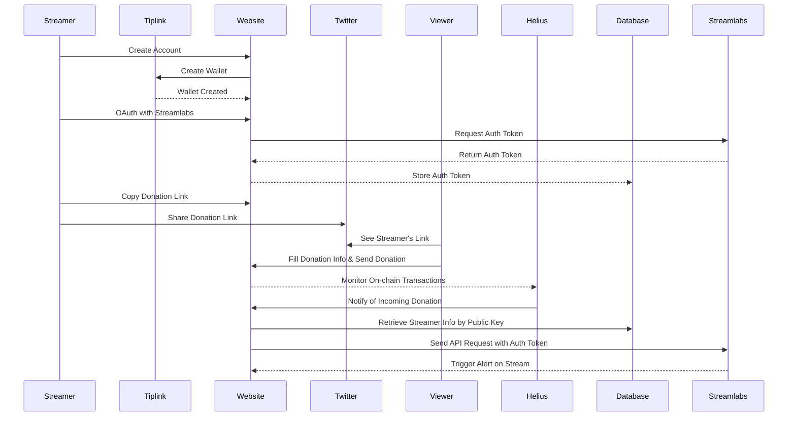

# Blurt.gg

## How it Works

### Demo

### High Level Flow



### Auth Flow

- Sign out flow ( how the user goes from signed in to signed out )
- Sign in flow ( how the user goes from signed out locally to signed in )
- Frontend -> Backend request flow ( how the frontend makes requests to the backend to modify state )
- Streamlabs auth flow ( how the user goes and gets a stream labs acess token )
- On page load flow ( determins if the user is log in and what state to show )

## Set Up and Host Yourself

### Register With Streamlabs

To set up a new distribution of the app and host it, you'll need your own streamlabs client id and secret. To get this you need to make an app on streamlabs and get your keys. You can follow the documentation found [here](https://dev.streamlabs.com/docs/getting-started).


### Setting Up Helius

1. Run the script with the command `npm run pubkey` to generate a new pubkey to use for Helius Webhooks
2. Add this pubkey as the HELIUS_WEBHOOK_PUBKEY var in your .env file
3. Add a secret string you come up with as the HELIUS_AUTH_HEADER var in your .env file
3. Go to the [Helius](https://www.helius.dev/) website and create an account
4. Go to the webhooks section of the developer portal
5. Create a new webhook with the following settings
- Network: Mainnet
- Webhook Type: Enhanced
- Transaction Type: Any
- Webhook Url: <url from ngrok>/api/helius
- Authentication Header: string from your .local.env file
- Account Address: Pubkey from your .local.env file
6. Go to your RPCs and copy the mainnet rpc url and add this as the RPC_URL var in your .env file

## Setting Up Database
- The existing version of the app uses [Planet Scale](https://planetscale.com/) for our database hosting service. We use (Prisma)[] as our orm so you can set up any SQL database hosting and connect it by changing the (primsa schema)(./prisma/schema.prisma) file. Depending on what you use here will required different prisma set up steps.

## Env File Variables

```
STREAMLABS_CLIENT_ID - Client ID given to you from Streamlabs
STREAMLABS_CLIENT_SECRET - Client Secret given to you from Streamlabs
NEXT_PUBLIC_BASE_URL - The domain of your hosted app, can be localhost:3000 if you're doing this locally
RPC_URL - Any RPC mainnet url you want to use, I use (Helius)[https://www.helius.dev/]
HELIUS_WEBHOOK_PUBKEY - Some pubkey to want to use to tag your transaction
HELIUS_AUTH_HEADER - Some secret string you set up on Helius to filter out transactions that aren't generated by you
DATABASE_URL - url for prisma to connect to your databse, depending on your hosting service look at prisma for details here
OPENAI_API_KEY - API key with Open AI
STREAMLABS_AUTH_SECRET - Random secret used for our auth model, can be any pubkey
```

## Todo

### Need to have
- Outline the full set up flow
- Make it work with current unfurling logic, were using stuff that's too new

### Nice to have
- Set up a devnet version for testing or for submission
- Have different pages for "landing" and "app"
- Build in "levels of confusing" modes ie. Just message + Send $1 vs.  All the tokens appearing
- Let streamers set their donation amount and token
- Let streamer pick a token to receive
- Add token swaps from the sender token to the receiver token
- See if we should be sending a donation post request instead of an alert

### Create Issues
- Make it friendlier to work with locally or devent
  - Add a local sql server

### Bugs
- Double notifactions when running locally since were using the same pubkeys for mainnet and local
- Fails on sol transfers since there is no tokenTransfers struct in the helius response
- Streamer name text does not render on production for the streamer image

### Doc Ideas
- How to set this up for yourself
- Code info
- Config stuff like env

### Branding Todos
- Make an info page
- New favicon
- Custom gif
- Add a real domain name

## Docs Outline
- Register w/ Streamlabs
- Setting Up Helius
- Setting Up Database
- How to Works ( Sequence Diagrams )
- Env File
- Video Demo
